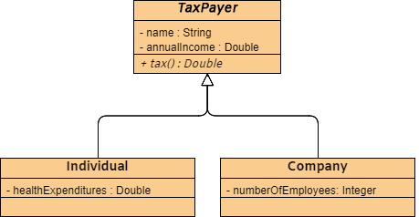

# inheritance1-java

Java OOP Inheritance exercise that brings together the concepts of an abstract class and shows how polymorphism is a powerful tool.

Below is the UML diagram used for the exercise.

